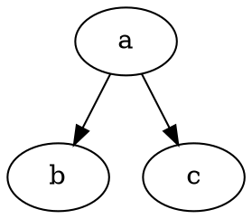
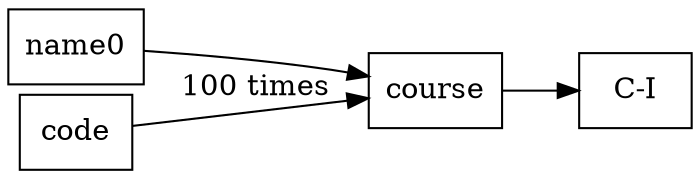

# Graphviz in Macdown

## First simple test

```dot
digraph first {
a -> {b c};
}
```

## Something more complex

```dot
digraph second {

	nodesep=0.05;
	rankdir=LR;
	node [shape=record];

	name0 -> course;
	code -> course [label="100 times"];
	course -> "C-I";

}
```
